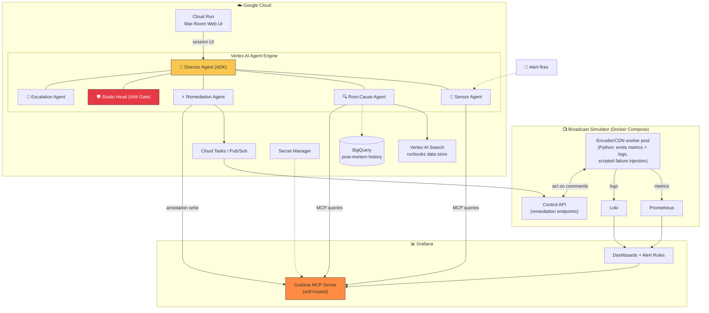
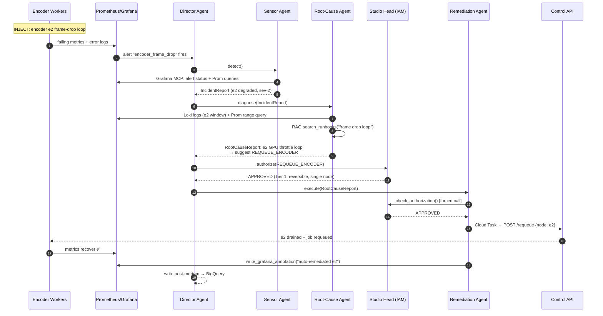
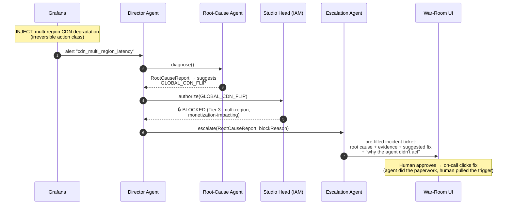
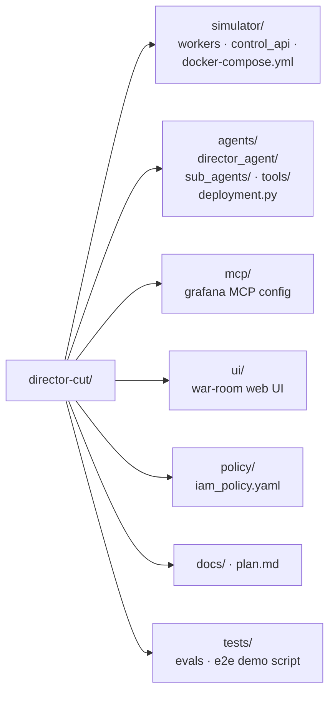

# 🎬 DIRECTOR'S CUT

> **When your live stream starts dying, your AI crew fixes it before the tweet storm hits.**
>
> A multi-agent network on Gemini + Google Cloud that watches Grafana, finds the root cause, remediates what it's allowed to — and escalates what it's not.

**Hackathon**: Summer Blockbuster (Google Cloud × Partners) — **Grafana Labs Track**
**Stack**: Gemini Enterprise Agent Platform · ADK on Vertex AI Agent Engine · Grafana MCP · Cloud Run · Cloud IAM

---

## 1. The Problem

Live events — sports finals, awards shows, season premieres — are the one format with **no second take**. When the encoding pipeline or CDN degrades mid-broadcast, today's response is a human war-room scramble: an on-call engineer stares at dashboards, manually correlates a bitrate drop with CDN edge health and player buffering, then pages three teams. Every minute of diagnosis is lost audience and lost revenue.

**Director's Cut** replaces that scramble with an autonomous AI production crew: it detects the incident, correlates metrics + logs to a root cause, checks a governance policy for what it may fix autonomously, executes the fix (or escalates a pre-filled ticket), and writes the post-mortem — in under two minutes.

---

## 2. The Crew (Agent Roster)

The system maps 1:1 onto the three personas named in the hackathon brief — **Director** (orchestration), **Technical Producer** (data pipelines), **Studio Head** (IAM/governance).

### 🎥 Director Agent — `director_agent`
- **Role**: Orchestrator. The ADK root `LlmAgent` deployed to Vertex AI Agent Engine.
- **Behavior**: Receives alert events, delegates to sub-agents in a deterministic sequence, holds the shared session state, and enforces the pipeline order: `detect → diagnose → policy-check → act-or-escalate → document`.
- **Tools**: none of its own — pure delegation via sub-agents (deterministic, not freeform).

### 📡 Sensor Agent — `sensor_agent`
- **Role**: Watches the broadcast. First responder.
- **Tools**:
  - `grafana_mcp` → `list_alert_rules`, `get_alert_status`, `query_prometheus`
  - `get_incident_context` (local) → enriches alert with recent change events
- **Output** (to session state): structured `IncidentReport` — which alert fired, affected streams, current metric values, severity, timestamp window.

### 🔍 Root-Cause Agent — `root_cause_agent`
- **Role**: The diagnostician. Correlates signals into an evidence-backed diagnosis.
- **Tools**:
  - `grafana_mcp` → `query_loki_logs`, `query_prometheus` (range queries over the incident window)
  - `search_runbooks` → Vertex AI Search data store RAG over past post-mortems and runbooks
- **Output**: `RootCauseReport` — root cause hypothesis, evidence list (log lines + metric series), blast radius, confidence score, suggested remediation id.

### ⚡ Remediation Agent — `remediation_agent`
- **Role**: The fixer. Executes ONLY pre-approved, deterministic remediations.
- **Tools**:
  - `check_authorization` (forced function call — **always runs before any action**)
  - `execute_remediation` → Cloud Tasks / Pub/Sub → Simulator control API (requeue stuck encoder, flip CDN routing flag)
  - `write_grafana_annotation` → marks the dashboard: what the agent did and when
- **Rule**: No LLM math, no invented actions. The remediation catalog is a fixed enum; the agent only selects from it.

### 🛡️ Studio Head Agent (IAM Gate) — `studio_head_agent`
- **Role**: Governance. The most demoable agent in the system.
- **Behavior**: Pure tool (no LLM judgment) — evaluates the proposed remediation against a Cloud IAM–backed policy:
  - **Tier 1 (auto-approve)**: reversible, low blast radius (requeue encoder job, retry segment upload)
  - **Tier 2 (approve + notify)**: routing flips (CDN failover) — reversible, notifies on-call
  - **Tier 3 (BLOCK → escalate)**: monetization-impacting, multi-region, or irreversible actions
- **Output**: `APPROVED` / `APPROVED_NOTIFY` / `BLOCKED` + reason string.

### 🚨 Escalation Agent — `escalation_agent`
- **Role**: When the Studio Head says no, this agent does the paperwork.
- **Tools**: `create_incident_ticket` → writes a fully pre-filled incident (root cause, evidence, suggested fix, policy block reason) to the UI queue + webhook (Slack/email-compatible).

---

## 3. System Architecture

### 3.1 Full system (component view)



### 3.2 Golden path — auto-remediation (demo scenario A)



### 3.3 Blocked path — governance wins (demo scenario B)



### 3.4 Repository structure



---

## 4. The 3-Minute Demo (video beats)

| Time | Beat |
|---|---|
| 00:00–00:30 | Live Grafana dashboard, healthy traffic. Narrate the stakes: "this is live — there's no re-air." |
| 00:30–01:00 | Inject encoder failure. Alert fires. Sensor Agent picks it up in seconds — show reasoning trace. |
| 01:00–01:45 | Root-Cause Agent correlates Loki logs + Prometheus + runbook RAG → names the cause with evidence. |
| 01:45–02:15 | **Scenario A**: IAM gate approves Tier-1 fix → auto-remediation fires → dashboard goes green → Grafana annotation appears. |
| 02:15–02:45 | **Scenario B**: multi-region incident → IAM gate **blocks** the agent → pre-filled escalation ticket, human approves. |
| 02:45–03:00 | Post-mortem auto-written to BigQuery. Tagline: *"The Director decides. The Studio Head decides what the Director may decide."* |

---

## 5. Tech Stack

| Layer | Technology |
|---|---|
| Agent framework | Google ADK (`google-cloud-aiplatform[agent_engines,adk]`) |
| Model | Gemini 2.5 Pro / Flash via Gemini Enterprise Agent Platform |
| Agent hosting | Vertex AI Agent Engine |
| Partner integration | **Grafana MCP server** (self-hosted) — dashboards, alerts, Prometheus, Loki, annotations |
| Observability | Grafana + Prometheus + Loki (Docker Compose) |
| Simulator | Python workers + FastAPI control API (scripted failure injection) |
| Governance | Cloud IAM (agent service account) + policy tiers YAML |
| Data | BigQuery (post-mortems), Vertex AI Search (runbook RAG) |
| Messaging | Cloud Tasks / Pub/Sub (remediation commands) |
| Secrets | Secret Manager |
| UI | War-room web UI on Cloud Run (reasoning trace + Grafana embed + ticket queue) |

---

## 6. Submission Checklist

- [ ] Public repo with `LICENSE` at root (visible in About section) — ✅ LICENSE already committed
- [ ] Hosted URL (Cloud Run UI)
- [ ] 3-min English demo video (YouTube/Vimeo, public)
- [ ] Grafana MCP imported **and called at runtime in code** (not just named)
- [ ] Real Google Cloud runtime (Agent Engine deployment, not local-only)
- [ ] Devpost form submitted with Grafana Labs track selected

---

## 7. Building

See **[plan.md](./plan.md)** for the full phased build plan with task tracking — start there if you're an agent (or human) resuming work.

```bash
# local simulator stack
docker compose -f simulator/docker-compose.yml up -d

# run agents locally (ADK dev UI)
adk web agents/

# deploy to Agent Engine
python agents/deployment.py
```
